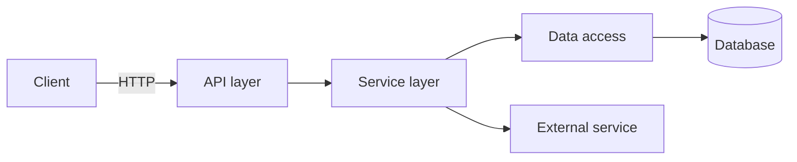

# Flowchart

Read the code, understand how the pieces connect, and produce a **visual diagram**
of the application — its flow and its dependencies. This skill is **language- and
stack-agnostic**: derive the structure from the actual code, then render it as a
diagram a developer can read at a glance.

## When to use

- A developer wants to *see* how the app is wired: request/control flow, data
  flow, module/component dependencies, or a call graph.
- Onboarding, planning a change, or explaining architecture to others.

## When NOT to use

- A written, narrative explanation is wanted → use `explain-code`.
- Producing prose docs/ADRs → use `documentation`.

## Workflow

### 1. Scope the diagram
- Clarify *what* to visualize and at *what altitude*:
  - **Application flow** — end-to-end path of a request/operation through the system.
  - **Dependency graph** — which modules/components/packages depend on which.
  - **Call graph** — functions/methods calling each other for a specific feature.
  - **Data flow** — how data moves and is transformed across components.
- Pick a scope that fits on one readable diagram; offer to split if too large.

### 2. Discover the structure from the code (stack-agnostic)
- Identify the language and layout from manifests/config and the directory tree
  (this is a single-app repo).
- Find **entry points** (main, server bootstrap, route/handler registration, CLI,
  jobs) — these anchor the flow.
- Trace dependencies by reading imports/includes/requires and call sites; follow
  the real edges rather than guessing.
- Note boundaries that matter for a diagram: external services, datastores,
  queues, and the **auth** and **secrets** touchpoints if relevant to the flow.

### 3. Build the model
- Collect **nodes** (components/modules/functions/services) and **edges**
  (calls / depends-on / data-flows-to), each edge with a direction and a short label.
- Keep it accurate: only draw edges you verified in the code. Mark anything
  uncertain explicitly rather than inventing connections.
- Group related nodes into subgraphs/layers (e.g. API → service → data) to keep
  the picture legible.

### 4. Render the diagram
- Default to **Mermaid** (`flowchart`/`graph` for flow & dependencies, `sequenceDiagram`
  for request sequences) inside a fenced ```mermaid block — it renders visually in
  Markdown and most Claude Code surfaces and stays diffable in the repo.
- If a richer rendered visual is available in the current surface, use it; fall
  back to clean ASCII if no diagram renderer is available.
- Keep labels short, direction consistent (top-down or left-right), and the node
  count manageable — split into multiple diagrams rather than one unreadable one.

### 5. Annotate and verify
- Add a short legend and a 2–4 line summary of the flow the diagram shows.
- Cite the key `file:line` anchors (entry points, major hops) so the diagram is
  traceable back to the code.
- Re-check each edge against the source before finishing.

## Example (Mermaid)



## Outputs

- A rendered diagram (Mermaid by default) of the requested flow/dependencies
- A short legend + summary of what it shows
- `file:line` anchors for the entry points and major hops
- Notes on any verified-uncertain or omitted edges (with reason)
